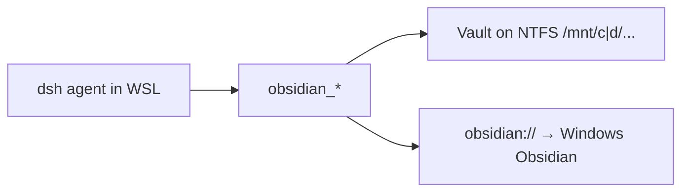

# dsh-wsl-obsidian
> **Install set:** optional companion to [dsh-wsl-kit](https://github.com/173787247/dsh-wsl-kit). Not in `KIT_SET=daily`. Fault tree: [TROUBLESHOOTING.md](https://github.com/173787247/dsh-wsl-kit/blob/master/docs/TROUBLESHOOTING.md).

DeepSeek Harness plugin: **WSL agent ↔ Windows Obsidian vault** — `obsidian_status` / `open` / `list` / `search` / `read` / `write` / `append`.

Standalone MIT plugin under **[dsh-wsl-kit](https://github.com/173787247/dsh-wsl-kit)** (optional; not shipped in `install.sh` by default).

[中文说明 → README.zh.md](./README.zh.md)

## Where it sits



Keep the vault on **Windows NTFS**. Opening a vault from `\\wsl$\…` breaks Obsidian’s file watcher.

## Compatibility

| Field | Value |
|-------|-------|
| **Plugin** | `dsh-wsl-obsidian` **0.1.0** |
| **Minimum dsh** | ≥ **0.1.2** |
| **Kit set** | optional (not in `daily`) |
| **Obsidian** | Windows desktop app (install from [obsidian.md](https://obsidian.md)) |

## Tools

| Tool | Role |
|------|------|
| `obsidian_status` | Resolve vault (`vaultPath` or `%APPDATA%\obsidian\obsidian.json`), path kind, `Obsidian.exe` |
| `obsidian_list` | List `.md` notes |
| `obsidian_search` | Case-insensitive substring search |
| `obsidian_read` | Read note |
| `obsidian_write` | Create / overwrite note |
| `obsidian_append` | Append to note |
| `obsidian_open` | `obsidian://open?vault=…&file=…` via PowerShell (WSL only) |

Paths are **vault-relative** (`Inbox/Note.md`). Absolute / `../` paths are rejected.

## Config

```yaml
- id: dsh-wsl-obsidian
  name: dsh-wsl-obsidian
  config:
    enabled: true
    vaultPath: "/mnt/d/Notes/MyVault"   # preferred
    vaultName: "MyVault"                # for obsidian://
    timeoutMs: 20000
```

If `vaultPath` is omitted, the plugin reads Windows `obsidian.json` through `/mnt/c/Users/…/AppData/Roaming/obsidian/`.

## Install

```sh
dsh plugin --profile web add github:173787247/dsh-wsl-obsidian
```

Restart `dsh web`, open a **new** session, run `obsidian_status`.

## Layout recommendation

1. Install Obsidian on **Windows**.
2. Create/open the vault under `C:\` or `D:\` (not inside the Linux distro disk).
3. From WSL use `/mnt/c/...` or `/mnt/d/...` as `vaultPath`.
4. Optional later: Local REST API — not required for 0.1.0.

## License

MIT
