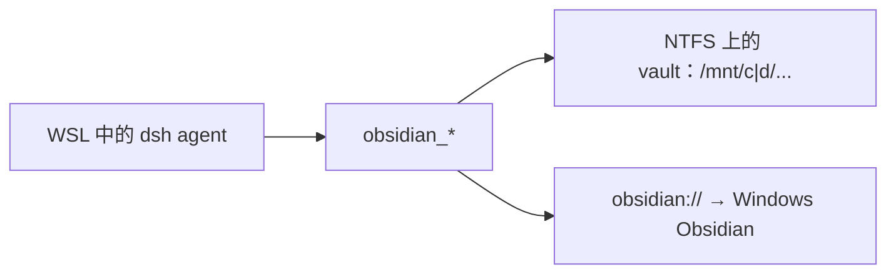

# dsh-wsl-obsidian
> **套件安装：** 可选配套 [dsh-wsl-kit](https://github.com/173787247/dsh-wsl-kit)。默认不在 `KIT_SET=daily`。故障树：[TROUBLESHOOTING.zh.md](https://github.com/173787247/dsh-wsl-kit/blob/master/docs/TROUBLESHOOTING.zh.md)。

DeepSeek Harness 插件：**WSL 里的 dsh agent ↔ Windows 上的 Obsidian vault**，提供 `obsidian_status` / `open` / `list` / `search` / `read` / `write` / `append`。

独立 MIT 插件，归属 **[dsh-wsl-kit](https://github.com/173787247/dsh-wsl-kit)** 生态（可选；默认不进 `install.sh`）。

[English → README.md](./README.md)

## 在套件里的位置



vault 请放在 **Windows NTFS**。用 Windows Obsidian 打开 `\\wsl$\…` 下的库时，文件监视经常不可靠。

## 兼容性

| 项 | 值 |
|----|----|
| **插件** | `dsh-wsl-obsidian` **0.2.1** |
| **最低 dsh** | ≥ **0.1.2** |
| **最新验证** | 以 [dsh-wsl-kit 兼容性](https://github.com/173787247/dsh-wsl-kit#compatibility-2026-09) 为准（当前 **`0.2.0-rc.2`**）— 套件唯一真源 |
| **套件档位** | 可选（不在 `daily`） |
| **Obsidian** | Windows 桌面版（[obsidian.md](https://obsidian.md)） |

## 工具

| 工具 | 作用 |
|------|------|
| `obsidian_status` | 解析 vault（配置或 `obsidian.json`）、路径类型、是否找到 `Obsidian.exe` |
| `obsidian_list` | 列出 `.md` |
| `obsidian_search` | 大小写不敏感子串搜索 |
| `obsidian_read` | 读笔记 |
| `obsidian_write` | 新建/覆盖 |
| `obsidian_append` | 追加 |
| `obsidian_open` | 经 PowerShell 打开 `obsidian://`（需在 WSL） |

路径均为 **vault 相对路径**；绝对路径与 `../` 会被拒绝。

## 配置

```yaml
- id: dsh-wsl-obsidian
  name: dsh-wsl-obsidian
  config:
    enabled: true
    vaultPath: "/mnt/d/Notes/MyVault"   # 推荐
    vaultName: "MyVault"
    timeoutMs: 20000
```

未设 `vaultPath` 时，会尝试读 `/mnt/c/Users/…/AppData/Roaming/obsidian/obsidian.json`。

## 安装

```sh
dsh plugin --profile web add github:173787247/dsh-wsl-obsidian
```

重启 `dsh web`，新开会话后先跑 `obsidian_status`。

## 布局建议

1. 在 **Windows** 安装 Obsidian。
2. vault 建在 `C:\` 或 `D:\`（不要放在 Linux 发行版磁盘里）。
3. WSL 侧 `vaultPath` 用 `/mnt/c/...` 或 `/mnt/d/...`。
4. Local REST API 为后续可选，0.1.0 不需要。

## 许可

MIT
